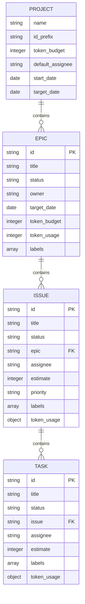
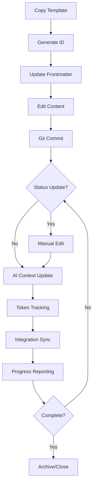
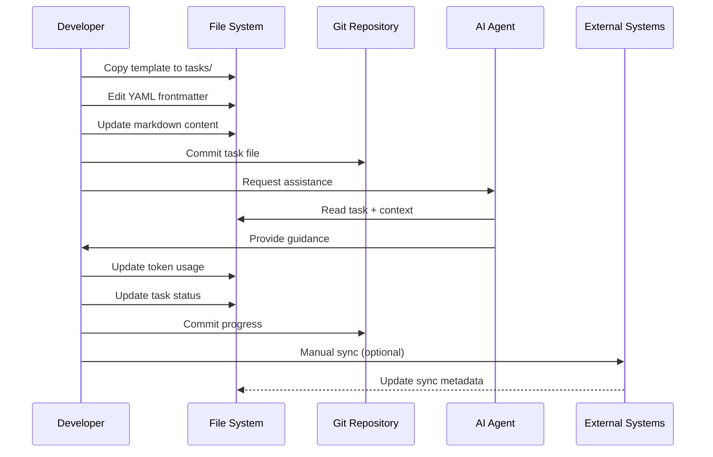
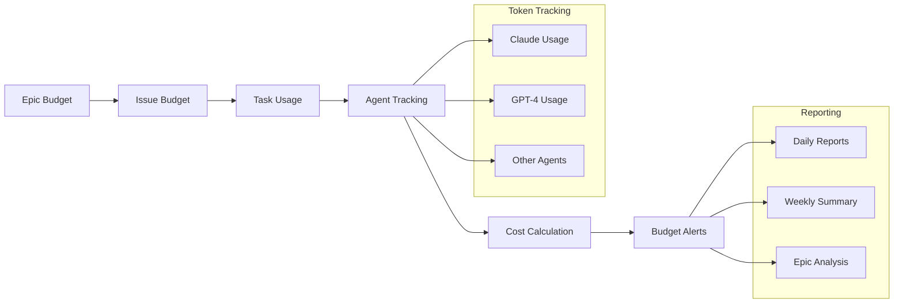
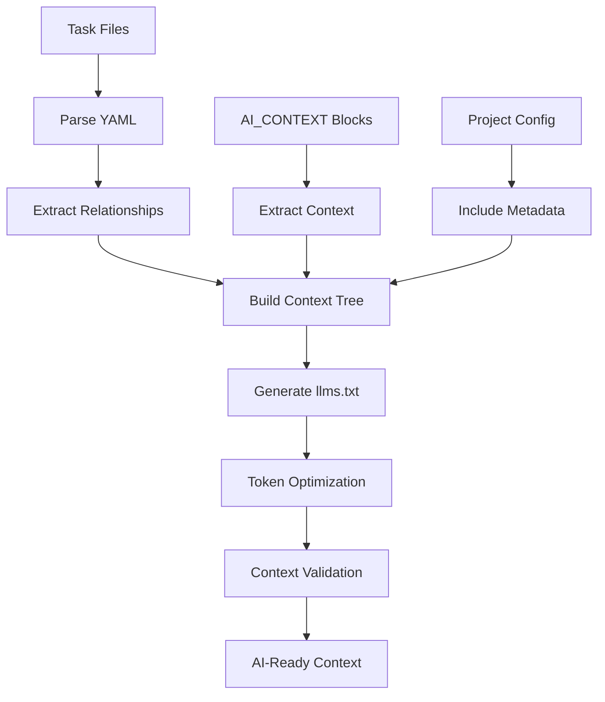
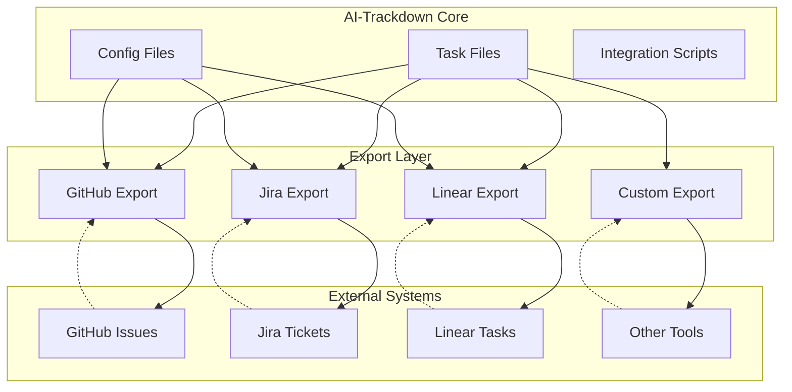
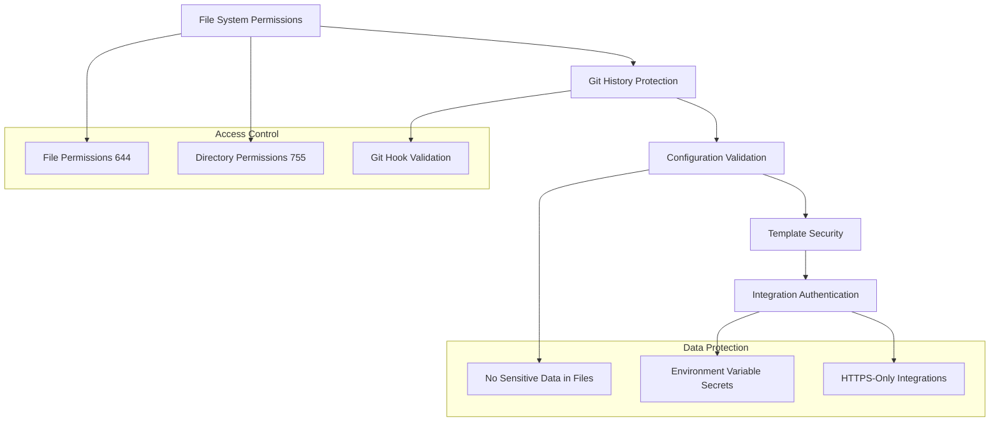

# AI-Trackdown Architecture

This document provides a comprehensive overview of AI-Trackdown's architecture, design principles, and framework implementation.

## 🎯 Design Philosophy

AI-Trackdown is built on five core principles that make it revolutionary for AI-enhanced development:

### 1. Text-First Architecture
**Principle**: All data stored as human-readable text files  
**Why**: Text is the universal interface between humans, AI agents, and tools  
**Implementation**: GitHub Flavored Markdown with YAML frontmatter  

### 2. Git-Native Storage
**Principle**: Leverage git as the primary data store  
**Why**: Distributed, versioned, and developer-familiar  
**Implementation**: Tasks live alongside code, use git workflows  

### 3. AI-Optimized Design
**Principle**: Minimize token consumption, maximize AI comprehension  
**Why**: Token costs are real and context efficiency matters  
**Implementation**: Structured formats, smart context generation, llms.txt standard  

### 4. Zero Lock-in Philosophy
**Principle**: Users own their data in portable formats  
**Why**: Avoid vendor dependency and ensure longevity  
**Implementation**: Pure markdown files, standard formats, easy migration  

### 5. Template-Driven Framework
**Principle**: Standardized templates with manual workflows  
**Why**: Consistency without tool dependency  
**Implementation**: Configurable templates, bash scripts, manual processes  

## 🏗️ Framework Architecture

### High-Level Overview

```
┌─────────────────────────────────────────────────────────────────┐
│                   AI-Trackdown Framework                        │
├─────────────────────────────────────────────────────────────────┤
│                                                                 │
│  ┌───────────────┐  ┌──────────────┐  ┌─────────────────────┐  │
│  │   Templates   │  │ Config Files │  │  Manual Workflows   │  │
│  │               │  │              │  │                     │  │
│  │ • epic.md     │  │ • config.yaml│  │ • Creation scripts  │  │
│  │ • issue.md    │  │ • github.yaml│  │ • Status updates    │  │
│  │ • task.md     │  │ • jira.yaml  │  │ • Token tracking    │  │
│  │ • custom.md   │  │ • llms.txt   │  │ • Reporting         │  │
│  └───────────────┘  └──────────────┘  └─────────────────────┘  │
│                                                                 │
├─────────────────────────────────────────────────────────────────┤
│                         File System                             │
├─────────────────────────────────────────────────────────────────┤
│                                                                 │
│  .ai-trackdown/          tasks/                docs/            │
│  ├── config.yaml         ├── epics/            ├── llms-full.txt│
│  ├── llms.txt           ├── issues/           └── guides/      │
│  ├── templates/         └── tasks/                             │
│  └── integrations/                                             │
│                                                                 │
├─────────────────────────────────────────────────────────────────┤
│                      Git Repository                             │
├─────────────────────────────────────────────────────────────────┤
│                                                                 │
│  ┌─────────────┐  ┌──────────────┐  ┌─────────────────────────┐ │
│  │   Commits   │  │   Branches   │  │    External Systems     │ │
│  │             │  │              │  │                         │ │
│  │ • Task refs │  │ • Epic       │  │ • GitHub Issues         │ │
│  │ • Token     │  │ • Feature    │  │ • Jira Tickets          │ │
│  │   tracking  │  │ • Hotfix     │  │ • Linear Tasks          │ │
│  │ • Progress  │  │ • Release    │  │ • Slack notifications   │ │
│  └─────────────┘  └──────────────┘  └─────────────────────────┘ │
│                                                                 │
└─────────────────────────────────────────────────────────────────┘
```

### Framework Components

#### 1. Template System
**Purpose**: Standardized markdown templates for consistent task structure  
**Components**:
- Epic templates for high-level goals
- Issue templates for development features
- Task templates for implementation details
- Custom templates for specialized workflows

#### 2. Configuration Management
**Purpose**: Project settings and integration configurations  
**Components**:
- Project metadata and token budgets
- Workflow definitions (statuses, labels, priorities)
- Integration mappings for external systems
- Validation rules and constraints

#### 3. Manual Workflow Scripts
**Purpose**: Bash/Python utilities for common operations  
**Components**:
- Task creation and ID generation
- Status updates and assignment
- Token usage tracking and reporting
- Integration export/import scripts

#### 4. AI Context System
**Purpose**: Optimized information for AI agent consumption  
**Components**:
- llms.txt project index files
- AI_CONTEXT blocks in tasks
- Relationship mapping and dependencies
- Token-efficient context generation

## 📊 Data Model

### Core Entities



### File Structure Specification

```
project-root/
├── .ai-trackdown/                   # Framework configuration
│   ├── config.yaml                  # Main configuration
│   ├── llms.txt                     # AI context index
│   ├── templates/                   # Task templates
│   │   ├── epic.md                  # Epic template
│   │   ├── issue.md                 # Issue template
│   │   ├── task.md                  # Task template
│   │   └── custom-*.md              # Custom templates
│   └── integrations/                # External system configs
│       ├── github.yaml              # GitHub integration
│       ├── jira.yaml                # Jira integration
│       └── linear.yaml              # Linear integration
│
├── tasks/                          # Task files
│   ├── epics/                      # Epic definitions
│   │   ├── EPIC-001-auth-system.md
│   │   └── EPIC-002-api-platform.md
│   ├── issues/                     # Issue/story definitions
│   │   ├── ISSUE-001-oauth-login.md
│   │   ├── ISSUE-002-password-reset.md
│   │   └── ISSUE-003-2fa-setup.md
│   └── tasks/                      # Task implementations
│       ├── TASK-001-login-form.md
│       ├── TASK-002-oauth-config.md
│       └── TASK-003-jwt-validation.md
│
├── docs/                           # Documentation
│   ├── llms-full.txt              # Complete AI context
│   ├── project-guide.md           # Project documentation
│   └── api-specs/                 # API specifications
│
├── TASKTRACK.md                    # Project dashboard
├── README.md                       # Project overview
└── CHANGELOG.md                    # Change history
```

## 🔄 Data Flow Architecture

### Task Lifecycle Flow



### Manual Workflow Process



## 🧠 AI Integration Architecture

### Token Economics Model



### AI Context Generation



### Context Optimization Strategy

1. **Hierarchical Context**: Epic → Issue → Task relationship mapping
2. **Dependency Tracking**: Automatic relationship discovery
3. **Token Budgeting**: Context size limits and priorities
4. **Smart Filtering**: Include only relevant information
5. **Update Triggers**: Manual refresh points for context

## 🔌 Integration Architecture

### External System Integration



### Integration Patterns

#### 1. Export-Based Sync
- **Pattern**: One-way export from AI-Trackdown to external systems
- **Use Case**: Creating GitHub issues from AI-Trackdown tasks
- **Implementation**: JSON/API export scripts

#### 2. Import-Based Sync
- **Pattern**: One-way import from external systems to AI-Trackdown
- **Use Case**: Importing existing GitHub issues into AI-Trackdown
- **Implementation**: API fetch and template generation scripts

#### 3. Bidirectional Sync
- **Pattern**: Two-way synchronization with conflict resolution
- **Use Case**: Maintaining consistency between AI-Trackdown and Jira
- **Implementation**: Sync state tracking and manual conflict resolution

#### 4. Reference-Based Integration
- **Pattern**: Store external system references in AI-Trackdown
- **Use Case**: Link AI-Trackdown tasks to external tickets
- **Implementation**: Sync metadata in task frontmatter

## 🛡️ Security Architecture

### Data Security Model



### Security Principles

1. **No Credentials in Files**: All secrets via environment variables
2. **Minimal Permissions**: Restrictive file and directory permissions
3. **Validation at Input**: YAML and template validation
4. **Secure Defaults**: HTTPS-only, certificate validation
5. **Audit Trail**: Git history for all changes

## 📈 Scalability Architecture

### Performance Characteristics

| Aspect | Small Project (< 100 tasks) | Medium Project (< 1000 tasks) | Large Project (< 10000 tasks) |
|--------|----------------------------|-------------------------------|-------------------------------|
| **File Operations** | Instant | < 1s | < 5s |
| **Context Generation** | < 1s | < 5s | < 30s |
| **Token Calculation** | Instant | < 2s | < 10s |
| **Git Operations** | Instant | < 1s | < 3s |
| **Integration Sync** | < 5s | < 30s | < 2min |

### Scalability Strategies

#### 1. File Organization
- **Directory Sharding**: Split large task sets across subdirectories
- **Archive Management**: Move completed tasks to archive directories
- **Index Files**: Maintain lightweight index files for quick access

#### 2. Context Management
- **Lazy Loading**: Generate context on demand
- **Caching**: Cache expensive operations like token calculations
- **Incremental Updates**: Update only changed context

#### 3. Integration Optimization
- **Batch Operations**: Group multiple updates into single API calls
- **Rate Limiting**: Respect external system rate limits
- **Parallel Processing**: Process independent tasks concurrently

#### 4. Git Performance
- **Shallow Clones**: Use shallow clones for CI/CD
- **File Filtering**: Use git sparse-checkout for large repos
- **LFS Integration**: Store large files in Git LFS if needed

## 🔧 Implementation Architecture

### Technology Stack

#### Core Technologies
- **File Format**: GitHub Flavored Markdown with YAML frontmatter
- **Configuration**: YAML configuration files
- **Scripting**: Bash and Python for automation
- **Version Control**: Git for all data storage
- **Templates**: Jinja2-style template variables

#### External Dependencies
- **Required**: Git, basic Unix tools (grep, sed, awk)
- **Optional**: Python (for advanced scripts), jq (for JSON processing)
- **Integrations**: curl/wget (for API calls), gh/jira CLI tools

### Framework Extension Points

#### 1. Custom Templates
- **Location**: `.ai-trackdown/templates/`
- **Format**: Markdown with YAML frontmatter
- **Variables**: Configurable substitution variables
- **Validation**: Schema validation for custom fields

#### 2. Workflow Customization
- **Configuration**: Status, label, and priority definitions
- **Validation Rules**: Custom validation logic
- **Transition Rules**: Allowed status transitions
- **Required Fields**: Field requirements by status

#### 3. Integration Plugins
- **Export Scripts**: Custom export format scripts
- **Import Scripts**: Custom data import scripts
- **Sync Logic**: Bidirectional synchronization patterns
- **Webhook Handlers**: Event-driven integrations

#### 4. Reporting Extensions
- **Report Templates**: Custom report formats
- **Data Aggregation**: Custom metrics and calculations
- **Visualization**: Integration with charting tools
- **Export Formats**: Multiple output format support

## 🎯 Design Decisions

### Key Architectural Decisions

#### 1. Why Markdown + YAML?
- **Human Readable**: Can be edited in any text editor
- **AI Friendly**: Optimal token efficiency for LLMs
- **Git Native**: Perfect for version control and diffing
- **Tool Agnostic**: Works with any markdown processor
- **Future Proof**: Will be readable for decades

#### 2. Why File-Based Storage?
- **Simplicity**: No database setup or maintenance
- **Portability**: Easy to backup, migrate, and share
- **Performance**: Excellent for small to medium datasets
- **Reliability**: Files don't go down or corrupt easily
- **Transparency**: All data is visible and inspectable

#### 3. Why Manual Workflows?
- **Reliability**: No daemon processes or background services
- **Control**: Users control exactly when operations happen
- **Transparency**: Every operation is explicit and visible
- **Debugging**: Easy to understand and fix issues
- **Simplicity**: No complex state management or race conditions

#### 4. Why Template-Driven?
- **Consistency**: Ensures uniform task structure
- **Flexibility**: Easy to customize for different needs
- **Standards**: Promotes best practices and conventions
- **Migration**: Easy to evolve templates over time
- **Integration**: Templates can map to external systems

### Trade-offs and Limitations

#### Advantages
- ✅ Zero runtime dependencies
- ✅ Perfect git integration
- ✅ AI-optimized design
- ✅ Human-readable format
- ✅ Easy backup and migration
- ✅ No vendor lock-in
- ✅ Scales to thousands of tasks
- ✅ Works offline
- ✅ Simple debugging

#### Limitations
- ❌ Manual workflows require discipline
- ❌ No real-time collaboration features
- ❌ Limited query capabilities without scripts
- ❌ No built-in UI (by design)
- ❌ Requires git knowledge
- ❌ Not suitable for very large datasets (>10k tasks)
- ❌ No automatic conflict resolution
- ❌ Limited concurrent editing support

### Future Architecture Considerations

#### Potential Enhancements
1. **Optional CLI Tools**: Lightweight tools for common operations
2. **Web Dashboard**: Read-only web interface for visualization
3. **API Layer**: REST API for programmatic access
4. **Real-time Sync**: Event-driven integration updates
5. **Advanced Search**: Full-text search capabilities
6. **Mobile Support**: Mobile-friendly viewing and editing

#### Backwards Compatibility
- **File Format Stability**: Markdown + YAML format will remain stable
- **Template Evolution**: Templates can evolve with backwards compatibility
- **Configuration Migration**: Automated migration for config changes
- **Data Preservation**: All historical data will remain accessible

This architecture ensures AI-Trackdown remains simple, reliable, and future-proof while providing powerful capabilities for AI-native development workflows.