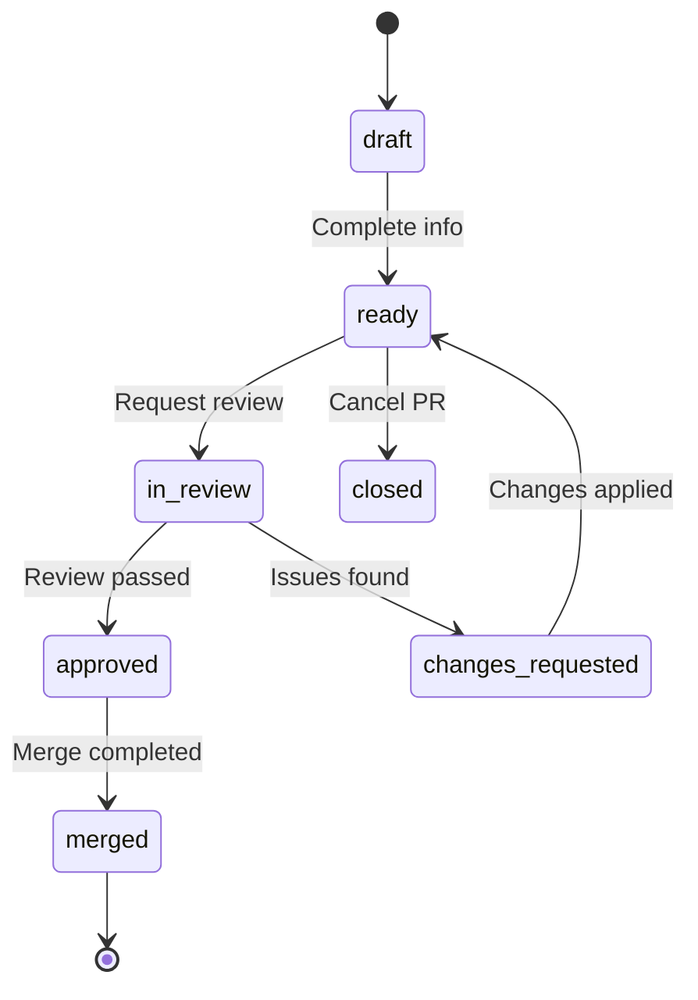

# ai-trackdown Manual Workflow Guide

## Pure Markdown-Based Task Management

This guide demonstrates how to use ai-trackdown as a pure documentation framework without any code implementation, relying entirely on markdown files and manual workflows.

## Table of Contents
- [Getting Started](#getting-started)
- [File Naming Conventions](#file-naming-conventions)
- [Task Lifecycle Management](#task-lifecycle-management)
- [Pull Request Workflows](#pull-request-workflows)
- [Status Management](#status-management)
- [Token Tracking Workflows](#token-tracking-workflows)
- [Team Collaboration](#team-collaboration)
- [Git Integration Patterns](#git-integration-patterns)
- [Reporting and Analytics](#reporting-and-analytics)

## Getting Started

### 1. Initialize Project Structure

Create the basic directory structure for your project:

```
your-project/
├── .ai-trackdown/
│   ├── config.yaml          # Project configuration
│   └── sync/                # External sync mappings (optional)
├── tasks/
│   ├── epics/               # High-level initiatives
│   ├── issues/              # Development issues
│   └── tasks/               # Granular tasks
├── docs/
│   ├── llms.txt             # AI index file
│   └── llms-full.txt        # Complete context file
└── AI-TRACKDOWN.md          # Project dashboard
```

### 2. Configure Your Project

Copy the configuration template and customize for your project:

```bash
cp templates/config-template.yaml .ai-trackdown/config.yaml
```

Edit the configuration with your project details:
- Project name and ID prefix
- Team member usernames
- Token budgets and thresholds
- Integration settings (optional)

### 3. Create Your First Epic

```bash
cp templates/epics/EPIC-XXX-name.md tasks/epics/EPIC-001-user-authentication.md
```

Fill in the epic details:
- Business context and success metrics
- Scope and requirements
- Implementation strategy
- Token budget allocation

## File Naming Conventions

### Consistent Naming Pattern
All task files follow a predictable naming convention:

- **Epics:** `EPIC-XXX-descriptive-name.md`
- **Issues:** `ISSUE-XXX-descriptive-name.md`  
- **Tasks:** `TASK-XXX-descriptive-name.md`

### ID Numbering
- Use sequential numbering: 001, 002, 003...
- Reserve ranges for different types if needed:
  - EPIC-001 to EPIC-099: Core epics
  - ISSUE-001 to ISSUE-999: Regular issues
  - TASK-001 to TASK-9999: Implementation tasks

### Descriptive Names
- Use kebab-case: `user-authentication`, `payment-integration`
- Keep names concise but descriptive
- Include key domain terms for searchability

## Task Lifecycle Management

### Creating New Work Items

#### 1. Epic Creation
1. Copy epic template to `tasks/epics/`
2. Fill in business context and success criteria
3. Define token budget and timeline
4. Break down into issues
5. Update project dashboard

#### 2. Issue Creation
1. Copy issue template to `tasks/issues/`
2. Link to parent epic
3. Define acceptance criteria
4. Estimate story points
5. Assign to team member
6. Add to sprint planning

#### 3. Task Creation
1. Copy task template to `tasks/tasks/`
2. Link to parent issue
3. Define specific implementation steps
4. Estimate time/complexity
5. Assign and prioritize

### Work Progression
```
Epic Planning → Issue Breakdown → Task Implementation → Review → Completion
```

### Status Updates
Manually update status fields in frontmatter:
```yaml
status: todo → in-progress → in-review → done
```

## Pull Request Workflows

The ai-trackdown framework includes a comprehensive GitHub-independent PR system for managing code changes and reviews within the markdown file structure.

### PR File Organization

PRs are organized in the `prs/` directory with status-based subdirectories:

```
prs/
├── active/          # Open PRs awaiting review or merge
├── merged/          # Completed PRs 
└── reviews/         # PR review documentation
```

### Creating a Pull Request

#### 1. Manual PR Creation
```bash
# Copy PR template
cp templates/pr-template.md prs/active/PR-001-feature-name.md
```

#### 2. Fill PR Information
Edit the frontmatter with required details:
```yaml
---
pr_id: "PR-001"
title: "Implement user authentication system"
author: "@johndoe"
reviewer: "@janedoe"
status: "draft"
target_branch: "main"
source_branch: "feature/auth-system"
linked_issues: ["ISSUE-001", "ISSUE-002"]
linked_tasks: ["TASK-001", "TASK-002", "TASK-003"]
files_changed: [
  "src/auth/login.js",
  "src/auth/middleware.js"
]
---
```

#### 3. Complete PR Description
- Fill summary of changes
- Detail implementation approach
- List testing performed
- Add screenshots if applicable
- Update review checklist

### PR Review Process

#### 1. Create Review File
```bash
# Copy review template
cp templates/pr-review-template.md prs/reviews/REV-001-feature-review.md
```

#### 2. Conduct Code Review
- **Code Quality**: Style, organization, best practices
- **Architecture**: Design patterns, separation of concerns
- **Security**: Vulnerabilities, authentication, authorization
- **Testing**: Coverage, quality, edge cases
- **Documentation**: Comments, API docs, user guides

#### 3. Document Review Decision
Update review file with findings:
```yaml
decision: "approve" | "request-changes" | "comment"
```

### PR Status Lifecycle



### PR-Task Integration

#### Linking PRs to Work Items
PRs should be linked to their related tasks and issues:
```yaml
linked_issues: ["ISSUE-001"]
linked_tasks: ["TASK-001", "TASK-002", "TASK-003"]
```

#### Task Status Updates
When PR is merged, update linked task statuses:
```yaml
# In task files
status: "completed"
resolution: "merged-in-PR-001"
completion_date: "2025-01-15"
```

### Quick PR Process

For minor changes, use the quick PR template:
```bash
cp templates/pr-quick-template.md prs/active/PR-002-quick-fix.md
```

This streamlined template is perfect for:
- Bug fixes
- Documentation updates
- Configuration changes
- Code cleanup

### Agent-Friendly PR Workflows

The PR system is designed to work seamlessly with AI agents:

#### Agent PR Creation
- Agents can create PRs by copying templates
- Auto-populate metadata from linked tasks
- Generate summaries from code changes
- Link related issues automatically

#### Agent Reviews
- Automated code quality checks
- Security vulnerability scanning
- Performance impact analysis
- Test coverage validation

### Git Integration

PRs integrate naturally with git workflows:

#### Branch Correlation
```yaml
source_branch: "feature/auth-system"
target_branch: "main"
commit_range: "abc123..def456"
```

#### Commit Messages
Reference PRs in commit messages:
```bash
git commit -m "feat(auth): implement login system

Implements user authentication with JWT tokens.
Related to PR-001 and resolves ISSUE-001."
```

### PR Archival

When PRs are completed:

#### Successful Merge
```bash
# Update status and move to merged/
mv prs/active/PR-001-feature.md prs/merged/
```

#### Closed Without Merge
```bash
# Update status to closed and move to merged/
mv prs/active/PR-001-feature.md prs/merged/
```

## Status Management

### Status Values and Meanings

#### Epic Status
- `planning` - Epic being scoped and planned
- `in-progress` - Active development work
- `on-hold` - Temporarily paused
- `blocked` - Waiting on dependencies
- `done` - Epic completed successfully
- `cancelled` - No longer needed

#### Issue Status  
- `open` - Ready for work to begin
- `in-progress` - Active development
- `blocked` - Cannot proceed
- `in-review` - Under review/testing
- `done` - Completed successfully
- `cancelled` - Work cancelled

#### Task Status
- `todo` - Not started
- `in-progress` - Being worked on
- `blocked` - Cannot proceed
- `in-review` - Under review
- `done` - Completed
- `cancelled` - No longer needed

### Manual Status Updates

#### Daily Practice
1. Review all assigned work items
2. Update status based on actual progress
3. Add activity log entries with timestamps
4. Update token usage if AI was involved
5. Note any blockers or dependencies

#### Weekly Practice
1. Review epic and issue progress
2. Update completion percentages
3. Reconcile token usage across items
4. Update project dashboard
5. Plan next week's priorities

## Token Tracking Workflows

### Manual Token Logging

#### When to Log Tokens
- After AI assistance on analysis or code review
- Following AI-generated content creation
- When using AI for planning or design
- After automated task creation or updates

#### How to Log Tokens
1. Update the `token_usage` section in frontmatter:
```yaml
token_usage:
  total: 1247
  by_agent:
    claude: 892
    copilot: 355
    gpt4: 0
```

2. Add activity log entry:
```markdown
- 2025-01-07T14:30:00Z: Claude analyzed requirements (tokens: 347)
```

3. Update budget tracking in parent epic

#### Token Attribution
- **Claude:** Analysis, code review, documentation
- **GPT-4:** Architecture design, planning
- **Copilot:** Code generation, boilerplate
- **Custom:** Other AI tools or services

### Budget Management

#### Epic-Level Budgets
Set token budgets for each epic based on complexity:
- Small epics (1-3 months): 50K-100K tokens
- Medium epics (3-6 months): 100K-250K tokens  
- Large epics (6+ months): 250K+ tokens

#### Budget Tracking
1. Allocate budget across phases:
   - Planning & Analysis: 20%
   - Implementation: 60%
   - Testing & QA: 15%
   - Documentation: 5%

2. Monitor usage weekly
3. Alert when approaching 80% of budget
4. Reallocate or request additional budget as needed

## Team Collaboration

### Assignment Workflows

#### Task Assignment
1. Update `assignee` field in frontmatter
2. Notify assignee via team communication channel
3. Add assignment to team dashboard
4. Track in weekly team meetings

#### Collaborative Work
- Use `@username` references in comments
- Tag related team members in activity logs
- Cross-reference work with `Related` sections
- Use team channels for coordination

### Review Processes

#### Code Review Integration
1. Create review tasks for significant work
2. Link reviews to original implementation tasks
3. Track review feedback in activity logs
4. Update status after review completion

#### Design Review
1. Schedule review meetings for epic planning
2. Document decisions in epic files
3. Update architecture context
4. Propagate decisions to related issues

### Communication Patterns

#### Daily Standups
- Review assigned tasks status
- Identify blockers and dependencies
- Plan day's priorities
- Update task status in real-time

#### Weekly Planning
- Review epic progress
- Plan upcoming sprint work
- Allocate team capacity
- Update project dashboard

## Git Integration Patterns

### Branch Naming
Follow consistent patterns linking to task IDs:
```
feature/ISSUE-001-login-flow
bugfix/TASK-042-fix-validation  
epic/EPIC-003-payment-system
```

### Commit Message Conventions
Reference task IDs in commit messages:
```
feat(ISSUE-001): implement user login form

- Add email/password validation
- Integrate with auth service
- Add loading states

Closes TASK-005
```

### Manual Git Workflows

#### Starting Work
1. Create feature branch with task ID
2. Update task status to `in-progress`
3. Add activity log entry
4. Begin implementation

#### During Development
1. Make regular commits with task references
2. Update task progress in comments
3. Log any AI assistance used
4. Push regularly for backup

#### Completing Work
1. Update task status to `in-review` or `done`
2. Create pull request referencing task
3. Add completion activity log
4. Update parent issue progress

### Status Automation (Manual)
While ai-trackdown can automate status updates via git hooks, you can manually implement similar patterns:

1. **On Commit:** Check for completion keywords in commit messages
2. **On PR:** Update task status to `in-review`
3. **On Merge:** Update task status to `done`
4. **Daily:** Review git activity and update task status

## Reporting and Analytics

### Manual Dashboard Updates

#### Daily Updates
Update `AI-TRACKDOWN.md` with:
- Current sprint progress
- Active issue status
- Recent completions
- Token usage updates
- Team availability

#### Weekly Reports  
Generate weekly summaries:
- Velocity and progress metrics
- Token usage analysis
- Risk assessment updates
- Team accomplishments
- Next week planning

### Analytics Workflows

#### Progress Tracking
1. Count completed vs. total story points
2. Calculate epic completion percentages
3. Track velocity trends
4. Monitor cycle time

#### Token Analysis
1. Aggregate token usage by epic/issue
2. Calculate cost per story point
3. Identify high-token consumers
4. Plan future budget allocations

#### Quality Metrics
1. Track defect rates
2. Monitor review feedback
3. Measure cycle times
4. Assess technical debt

### Reporting Templates

#### Weekly Status Report
```markdown
# Weekly Status Report - Week of [Date]

## Progress Summary
- Completed: X story points
- In Progress: Y story points  
- Velocity: Z points/week

## Token Usage
- This week: X tokens ($Y cost)
- Total project: X tokens (Z% of budget)

## Key Accomplishments
- [Major completion or milestone]
- [Significant decision or breakthrough]

## Upcoming Priorities
- [Next week's focus areas]
- [Critical path items]

## Risks and Issues
- [Current blockers or concerns]
- [Mitigation strategies]
```

#### Monthly Epic Review
```markdown
# Epic Review - [Epic Name] - [Month Year]

## Progress Update
- Completion: X% (Y/Z story points)
- Timeline: On track / At risk / Delayed
- Budget: X% of token budget used

## Key Achievements
- [Major milestones reached]
- [Technical breakthroughs]

## Challenges and Lessons
- [Obstacles overcome]
- [Process improvements identified]

## Next Month Focus
- [Priority areas]
- [Resource needs]
```

## Best Practices

### File Organization
- Keep consistent directory structure
- Use meaningful file names
- Maintain clean frontmatter
- Update timestamps regularly

### Content Quality
- Write clear, actionable acceptance criteria
- Provide sufficient context for future reference
- Link related work items
- Document decisions and rationale

### Team Coordination
- Regular status updates
- Clear communication about blockers
- Shared understanding of priorities
- Consistent use of conventions

### Maintenance
- Weekly dashboard updates
- Monthly epic reviews
- Quarterly process improvements
- Regular backup and archival

## Troubleshooting

### Common Issues

#### Inconsistent Status
**Problem:** Task status doesn't match actual progress
**Solution:** Daily status review and updates

#### Missing Token Data
**Problem:** AI usage not being tracked
**Solution:** Establish routine for logging AI interactions

#### Broken Links
**Problem:** References between tasks are outdated
**Solution:** Regular link verification and updates

#### Outdated Dashboard
**Problem:** AI-TRACKDOWN.md doesn't reflect current state
**Solution:** Automated or scheduled dashboard updates

### Process Improvements

#### Regular Retrospectives
- What's working well?
- What could be improved?
- What process changes would help?

#### Tool Optimization
- Are templates serving their purpose?
- Do naming conventions work for the team?
- Is the directory structure optimal?

#### Team Training
- Regular onboarding for new team members
- Sharing best practices across teams
- Continuous improvement mindset