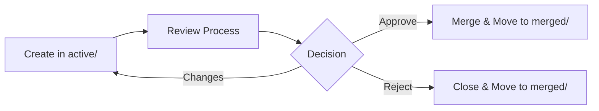
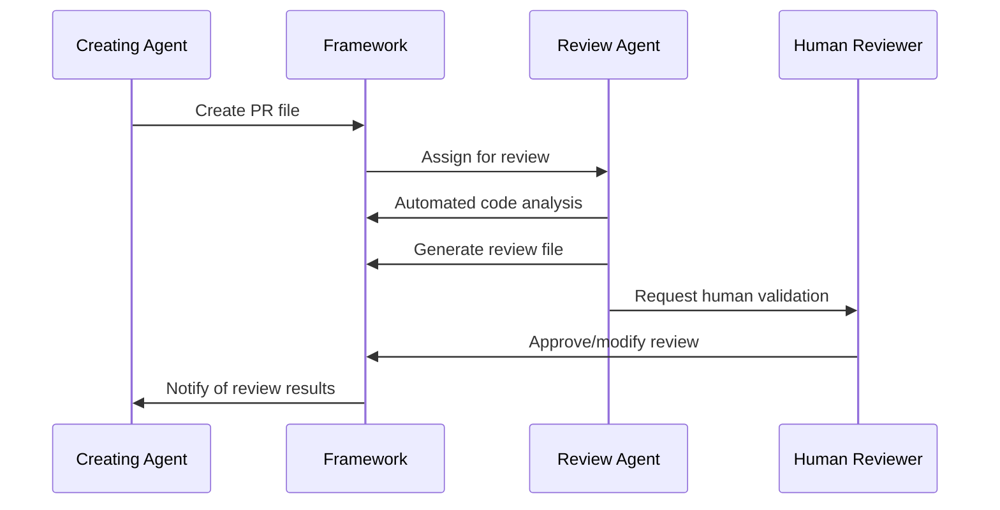
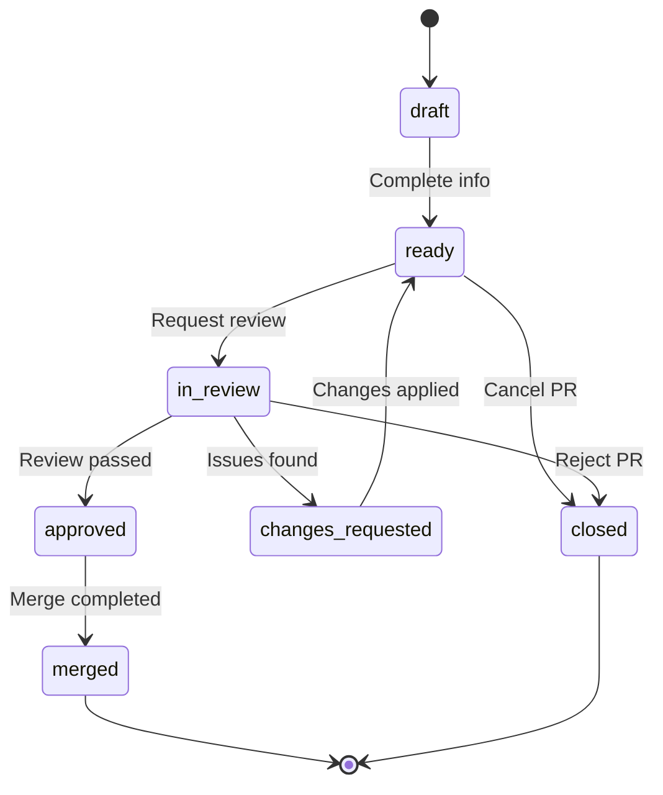

# Pull Request Workflows Guide

This document provides comprehensive guidance for managing pull requests within the ai-trackdown markdown framework, including manual workflows, agent-to-agent processes, and user-controlled PR management.

---

## 🎯 Overview

The ai-trackdown PR model is designed to be **GitHub-independent** and **framework-native**, enabling agent-to-agent workflows, manual processes, and user-controlled pull request management entirely within the markdown file system.

### Key Principles

1. **Framework-Native**: PRs exist as markdown files within the project structure
2. **Agent-Friendly**: Optimized for AI agent creation and management
3. **GitHub-Independent**: No dependency on external PR systems
4. **Audit Trail**: Complete history tracked in git
5. **Token Efficient**: Optimized for AI agent token consumption

---

## 📁 PR File Organization

### Directory Structure
```
prs/
├── active/                 # Open/active PRs
│   ├── PR-001-auth-feature.md
│   ├── PR-002-api-refactor.md
│   └── PR-003-bug-fix.md
├── merged/                 # Completed PRs
│   ├── PR-004-login-fix.md
│   └── PR-005-docs-update.md
└── reviews/                # Review documentation
    ├── REV-001-auth-review.md
    ├── REV-002-api-review.md
    └── REV-003-bug-review.md
```

### File Movement Lifecycle


---

## 🤖 Agent-to-Agent PR Workflows

### 1. Agent PR Creation Process

#### Step 1: Agent Identifies Need for PR
```yaml
# Agent detects need for PR based on:
triggers:
  - Multiple related task completions
  - Feature implementation ready
  - Bug fix ready for review
  - Refactoring completed
```

#### Step 2: Agent Creates PR File
```bash
# Agent workflow for PR creation
cp templates/pr-template.md prs/active/PR-XXX-feature-name.md

# Agent populates required fields:
# - pr_id (auto-generated)
# - title (descriptive)
# - author (agent identifier)
# - linked_issues/tasks
# - files_changed
# - auto-generated summary
```

#### Step 3: Agent Links Related Items
```yaml
# Agent automatically links:
linked_issues: ["ISSUE-001", "ISSUE-002"]
linked_tasks: ["TASK-005", "TASK-006", "TASK-007"]
related_commits: ["abc123", "def456"]
```

### 2. Agent-to-Agent Review Process

#### Automated Review Assignment
```yaml
# Agent determines reviewer based on:
reviewer_selection:
  - Code area expertise
  - Workload balancing
  - Previous review history
  - Availability status
```

#### AI Code Review Workflow


### 3. Intelligent PR Automation

#### Auto-Merge Criteria
```yaml
auto_merge:
  enabled: true
  conditions:
    - no_breaking_changes: true
    - test_coverage: ">= 80%"
    - security_scan: "passed"
    - performance_impact: "minimal"
    - reviewer_approval: true
```

#### Smart PR Batching
```yaml
# Agent groups related changes
batch_criteria:
  - same_feature_area: true
  - related_tasks: true
  - low_complexity: true
  - same_sprint: true
```

---

## 👥 Manual PR Workflows

### 1. Manual PR Creation

#### Step 1: Copy Template
```bash
# Copy PR template to active directory
cp templates/pr-template.md prs/active/PR-001-my-feature.md
```

#### Step 2: Fill Required Information
```yaml
---
pr_id: "PR-001"
title: "Implement user authentication system"
author: "@johndoe"
reviewer: "@janedoe"
status: "draft"
target_branch: "main"
source_branch: "feature/auth-system"
linked_issues: ["ISSUE-001", "ISSUE-002"]
linked_tasks: ["TASK-001", "TASK-002", "TASK-003"]
created_at: "2025-01-15T10:30:00Z"
files_changed: [
  "src/auth/login.js",
  "src/auth/middleware.js",
  "tests/auth.test.js"
]
---
```

#### Step 3: Complete PR Description
- Fill in summary section
- Detail changes made
- Update testing strategy
- Add screenshots if applicable

### 2. Manual Review Process

#### Step 1: Create Review File
```bash
# Create review file using review template
cp templates/pr-review-template.md prs/reviews/REV-001-auth-review.md
```

#### Step 2: Conduct Review
- Code quality assessment
- Architecture review
- Security evaluation
- Testing validation
- Documentation check

#### Step 3: Update PR Status
```yaml
# Update PR file with review results
status: "in-review"  # -> "approved" | "changes-requested"
approval_count: 1
review_requests: ["@janedoe"]
```

### 3. Manual Merge Process

#### Step 1: Final Validation
```bash
# Verify all conditions met
- All reviewers approved
- Tests passing
- No merge conflicts
- Documentation updated
```

#### Step 2: Merge and Archive
```bash
# Update PR status
status: "merged"

# Move to merged directory
mv prs/active/PR-001-my-feature.md prs/merged/
```

---

## 🎮 User-Controlled PR Processes

### 1. User-Initiated PR Creation

#### Via CLI Commands (Future)
```bash
# Future CLI integration
ai-trackdown pr create \
  --title "Fix authentication bug" \
  --issues "ISSUE-001,ISSUE-002" \
  --tasks "TASK-005" \
  --reviewer "@janedoe"
```

#### Via Manual Template Copy
```bash
# Current manual process
cp templates/pr-quick-template.md prs/active/PR-XXX-quick-fix.md
```

### 2. User-Controlled Review Workflows

#### Review Assignment
```yaml
# User controls review process
review_workflow:
  - automatic_assignment: false
  - manual_reviewer_selection: true
  - review_checklist_required: true
  - approval_threshold: 1
```

#### Review Oversight
```yaml
# User can override agent decisions
user_controls:
  - override_auto_approval: true
  - require_human_review: true
  - custom_review_criteria: enabled
  - manual_merge_control: true
```

### 3. User Approval Gates

#### Critical Changes
```yaml
# Require user approval for:
user_approval_required:
  - breaking_changes: true
  - security_modifications: true
  - architecture_changes: true
  - production_deployments: true
```

---

## 🔄 PR Status Lifecycle

### Status Flow Diagram


### Status Definitions

| Status | Description | Next Actions |
|--------|-------------|--------------|
| `draft` | PR being prepared | Complete and mark ready |
| `ready` | Ready for review | Assign reviewer |
| `in-review` | Under review | Wait for review completion |
| `approved` | Review passed | Merge PR |
| `changes-requested` | Needs modifications | Apply changes |
| `merged` | Successfully merged | Archive PR |
| `closed` | Closed without merge | Archive PR |

---

## 🔗 PR-Task Integration Patterns

### 1. Task-Driven PR Creation

#### Single Task PR
```yaml
# One task = one PR pattern
linked_tasks: ["TASK-001"]
scope: "minimal"
merge_strategy: "squash"
```

#### Multi-Task Feature PR
```yaml
# Multiple related tasks
linked_tasks: ["TASK-001", "TASK-002", "TASK-003"]
scope: "feature"
merge_strategy: "merge"
```

#### Issue-Complete PR
```yaml
# Complete issue implementation
linked_issues: ["ISSUE-001"]
linked_tasks: ["TASK-001", "TASK-002", "TASK-003", "TASK-004"]
scope: "issue-complete"
merge_strategy: "merge"
```

### 2. PR-Task Synchronization

#### Task Status Updates
```yaml
# When PR is approved, update linked tasks
task_sync:
  - status: "completed"
  - resolution: "merged-in-PR-001"
  - completion_date: auto
```

#### Reverse Task Creation
```yaml
# Create tasks from PR review feedback
review_tasks:
  - "TASK-010: Fix security vulnerability"
  - "TASK-011: Add error handling"
  - "TASK-012: Update documentation"
```

---

## 🛡️ Security and Compliance

### 1. Security Review Requirements

#### Automated Security Checks
```yaml
security_gates:
  - dependency_scan: required
  - secret_detection: required
  - code_analysis: required
  - vulnerability_assessment: required
```

#### Manual Security Review
```yaml
security_review:
  required_for:
    - authentication_changes: true
    - authorization_changes: true
    - data_handling_changes: true
    - external_integrations: true
```

### 2. Compliance Tracking

#### Audit Trail
```yaml
# Complete audit trail in git
audit_tracking:
  - pr_creation: git_commit
  - review_process: git_history
  - approval_decisions: file_updates
  - merge_actions: git_merge
```

#### Compliance Reports
```yaml
# Generate compliance reports
compliance_metrics:
  - review_coverage: "100%"
  - approval_tracking: "complete"
  - change_documentation: "required"
  - security_validation: "mandatory"
```

---

## 📊 PR Metrics and Reporting

### 1. PR Performance Metrics

#### Cycle Time Tracking
```yaml
metrics:
  - creation_to_review: "time_in_draft"
  - review_to_approval: "review_duration"
  - approval_to_merge: "merge_delay"
  - total_cycle_time: "end_to_end"
```

#### Quality Metrics
```yaml
quality_tracking:
  - review_thoroughness: "comments_per_change"
  - defect_detection: "issues_found"
  - rework_frequency: "revision_count"
  - approval_accuracy: "post_merge_issues"
```

### 2. Automated Reporting

#### Daily PR Dashboard
```yaml
daily_report:
  - active_prs: count
  - prs_awaiting_review: list
  - prs_ready_to_merge: list
  - overdue_reviews: alerts
```

#### Weekly Analytics
```yaml
weekly_analytics:
  - throughput: "prs_per_week"
  - cycle_time_trends: "time_analysis"
  - review_quality: "feedback_metrics"
  - bottleneck_analysis: "delay_points"
```

---

## 🔧 Integration with External Systems

### 1. Git Integration

#### Branch Correlation
```yaml
# Link PRs to git branches
git_integration:
  - source_branch: "feature/auth-system"
  - target_branch: "main"
  - commit_range: "abc123..def456"
  - diff_summary: auto_generated
```

#### Commit Message Integration
```bash
# Reference PRs in commit messages
git commit -m "feat(auth): implement login system

Implements user authentication with JWT tokens.
Related to PR-001 and resolves ISSUE-001.

Co-authored-by: AI Agent <agent@ai-trackdown>"
```

### 2. External PR System Sync

#### GitHub Integration (Optional)
```yaml
# Sync with GitHub PRs
github_sync:
  - export_to_github: optional
  - import_from_github: optional
  - bidirectional_sync: configurable
  - conflict_resolution: "local_wins"
```

#### GitLab/Bitbucket Integration
```yaml
# Similar patterns for other platforms
platform_sync:
  - platform: "gitlab" | "bitbucket" | "azure"
  - sync_strategy: "export" | "import" | "bidirectional"
  - mapping_rules: configurable
```

---

## 🚀 Best Practices

### 1. PR Creation Best Practices

#### Size Guidelines
- **Small PRs**: Single task, < 200 lines changed
- **Medium PRs**: Related tasks, < 500 lines changed  
- **Large PRs**: Complete feature, < 1000 lines changed
- **Epic PRs**: Avoid, break into smaller PRs

#### Naming Conventions
```yaml
# PR naming patterns
naming:
  format: "PR-XXX-descriptive-name"
  title_format: "{type}({scope}): {description}"
  examples:
    - "feat(auth): implement JWT authentication"
    - "fix(api): resolve user creation bug"
    - "docs(readme): update installation guide"
```

### 2. Review Best Practices

#### Review Checklist
- [ ] Code quality and style
- [ ] Architecture compliance
- [ ] Security considerations
- [ ] Performance impact
- [ ] Test coverage
- [ ] Documentation updates

#### Review Timeliness
```yaml
review_sla:
  - small_pr: "4 hours"
  - medium_pr: "1 day"
  - large_pr: "2 days"
  - critical_fix: "1 hour"
```

### 3. Merge Best Practices

#### Merge Strategies
- **Squash**: For feature branches, clean history
- **Merge**: For collaborative branches, preserve context
- **Rebase**: For linear history, advanced users

#### Post-Merge Actions
- [ ] Update linked tasks status
- [ ] Archive PR file
- [ ] Update project dashboard
- [ ] Notify stakeholders

---

## 🔮 Future Enhancements

### 1. Advanced Automation

#### ML-Powered Review Assignment
```yaml
# Future: ML-based reviewer selection
ml_assignment:
  - expertise_matching: code_area_analysis
  - workload_balancing: current_review_load
  - historical_performance: review_quality_scores
  - availability_prediction: calendar_integration
```

#### Intelligent PR Batching
```yaml
# Future: Smart PR grouping
intelligent_batching:
  - dependency_analysis: automatic
  - risk_assessment: ml_powered
  - testing_optimization: parallel_execution
  - deployment_coordination: automated
```

### 2. Enhanced Integration

#### Real-time Collaboration
```yaml
# Future: Real-time PR collaboration
collaboration:
  - live_review_sessions: video_integration
  - collaborative_editing: concurrent_modifications
  - instant_notifications: real_time_updates
  - mobile_support: mobile_app_integration
```

#### Advanced Analytics
```yaml
# Future: Advanced PR analytics
analytics:
  - predictive_cycle_time: ml_models
  - quality_prediction: defect_probability
  - reviewer_performance: detailed_metrics
  - process_optimization: continuous_improvement
```

---

This comprehensive PR workflow guide ensures that the ai-trackdown framework supports all types of PR management while maintaining its GitHub-independent, agent-friendly design principles.