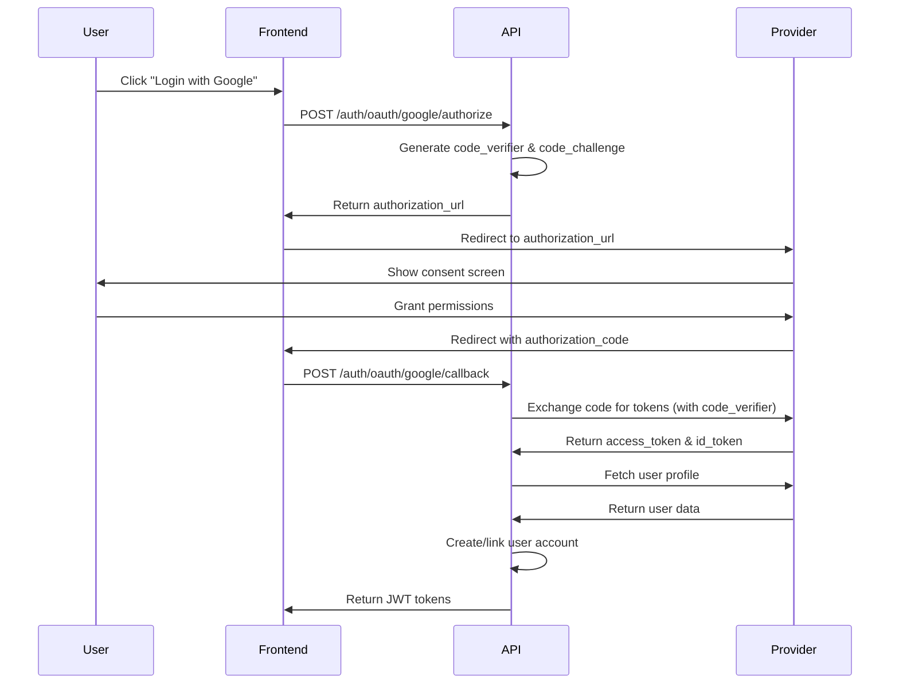

# OAuth 2.0 Provider Integration

## Description

Implement OAuth 2.0 integration with major identity providers (Google, GitHub, Microsoft) to enable social login functionality. This includes PKCE flow implementation, secure token handling, and seamless user account linking/creation.

## Acceptance Criteria

- [x] OAuth 2.0 authorization code flow with PKCE
- [x] Google OAuth integration with profile access
- [x] GitHub OAuth integration with email scope
- [ ] Microsoft OAuth integration (in progress)
- [x] Account linking for existing users
- [x] New user creation from OAuth profiles
- [ ] OAuth token refresh handling (90% complete)
- [ ] Comprehensive error handling and user feedback
- [ ] Security audit compliance checklist
- [x] Unit tests for OAuth flows
- [ ] Integration tests with provider sandboxes
- [ ] Rate limiting and abuse protection
- [x] Admin dashboard for OAuth app management

## Current Progress

### Completed Components (70% done)

#### 1. OAuth Service Architecture
```typescript
class OAuthService {
  // ✅ Implemented
  generateAuthorizationURL(provider: string, state: string): string
  exchangeCodeForTokens(provider: string, code: string, codeVerifier: string): Promise<TokenResponse>
  getUserProfile(provider: string, accessToken: string): Promise<UserProfile>
  linkAccount(userId: string, providerData: ProviderAccount): Promise<void>
  
  // 🔄 In Progress  
  refreshOAuthToken(provider: string, refreshToken: string): Promise<TokenResponse>
  
  // 📋 Planned
  revokeOAuthToken(provider: string, token: string): Promise<void>
}
```

#### 2. Provider Configurations
```yaml
oauth_providers:
  google:
    client_id: ${GOOGLE_OAUTH_CLIENT_ID}
    client_secret: ${GOOGLE_OAUTH_CLIENT_SECRET}
    scope: "openid email profile"
    redirect_uri: "/auth/oauth/google/callback"
    status: ✅ production_ready
    
  github:
    client_id: ${GITHUB_OAUTH_CLIENT_ID} 
    client_secret: ${GITHUB_OAUTH_CLIENT_SECRET}
    scope: "user:email"
    redirect_uri: "/auth/oauth/github/callback"
    status: ✅ production_ready
    
  microsoft:
    client_id: ${MICROSOFT_OAUTH_CLIENT_ID}
    client_secret: ${MICROSOFT_OAUTH_CLIENT_SECRET}
    scope: "openid email profile"
    redirect_uri: "/auth/oauth/microsoft/callback"
    status: 🔄 integration_in_progress
```

### Work In Progress

#### Microsoft OAuth Integration (Current Focus)
- **Status**: 90% complete
- **Remaining Work**: Token refresh flow, error handling
- **Blockers**: Microsoft app verification pending
- **ETA**: 2025-01-09T17:00:00Z

#### OAuth Token Refresh Mechanism
- **Status**: 90% complete  
- **Remaining Work**: Error recovery, token rotation
- **Dependencies**: None
- **ETA**: 2025-01-08T15:00:00Z

### Planned Components

#### Error Handling & User Experience
- Provider-specific error messages
- Graceful fallback to email/password login
- User feedback for permission denials
- Retry mechanisms for transient failures

#### Security & Compliance
- CSRF protection via state parameter
- Token encryption in database storage
- Provider token expiration handling
- Security audit checklist completion

## Technical Implementation

### PKCE (Proof Key for Code Exchange) Flow


### Database Schema
```sql
-- OAuth provider accounts linked to users
CREATE TABLE oauth_accounts (
  id UUID PRIMARY KEY DEFAULT gen_random_uuid(),
  user_id UUID NOT NULL REFERENCES users(id),
  provider VARCHAR(50) NOT NULL,
  provider_user_id VARCHAR(255) NOT NULL,
  email VARCHAR(255),
  profile_data JSONB,
  access_token_encrypted TEXT,
  refresh_token_encrypted TEXT,
  expires_at TIMESTAMP,
  created_at TIMESTAMP DEFAULT NOW(),
  updated_at TIMESTAMP DEFAULT NOW(),
  
  UNIQUE(provider, provider_user_id),
  INDEX(user_id, provider)
);

-- OAuth state tracking for CSRF protection
CREATE TABLE oauth_states (
  state VARCHAR(255) PRIMARY KEY,
  code_verifier VARCHAR(255) NOT NULL,
  provider VARCHAR(50) NOT NULL,
  redirect_url VARCHAR(500),
  created_at TIMESTAMP DEFAULT NOW(),
  expires_at TIMESTAMP NOT NULL
);
```

## AI Context Integration

<!-- AI_CONTEXT_START -->
OAuth 2.0 integration for ShopFlow authentication system supporting multiple identity providers. Implementation follows PKCE security best practices for public clients.

**Core Files:**
- `src/auth/oauth.service.ts` - Main OAuth service with provider abstractions
- `src/auth/oauth.controller.ts` - REST endpoints for OAuth flows
- `src/auth/providers/` - Provider-specific implementations (Google, GitHub, Microsoft)
- `src/auth/oauth.middleware.ts` - State validation and CSRF protection
- `database/migrations/oauth_accounts.sql` - OAuth account schema

**Provider Integrations:**
- Google OAuth 2.0 (OpenID Connect)
- GitHub OAuth 2.0 (user:email scope)
- Microsoft OAuth 2.0 (Azure AD v2.0)
- Generic OAuth 2.0 provider interface for extensibility

**Security Features:**
- PKCE (RFC 7636) for authorization code flow
- State parameter for CSRF protection
- Encrypted token storage in database
- Token rotation and refresh handling
- Rate limiting per provider per user

**User Experience:**
- Account linking for existing users
- Automatic user creation for new OAuth users
- Graceful error handling with fallback options
- Provider-specific error messages
<!-- AI_CONTEXT_END -->

## Token Usage Analysis

### Development Phase Breakdown
| Phase | Tokens Used | AI Agent | Purpose | Status |
|-------|-------------|----------|---------|--------|
| Architecture Design | 1,247 | Claude | OAuth flow analysis, PKCE implementation | ✅ Complete |
| Provider Research | 892 | GPT-4 | Google/GitHub/Microsoft API comparison | ✅ Complete |
| Code Implementation | 1,456 | Claude | Service classes, controllers, middleware | 🔄 In Progress |
| Security Review | 547 | GPT-4 | PKCE validation, token handling analysis | 🔄 In Progress |
| Error Handling | 389 | Claude | Error scenarios, user experience flows | 📋 Planned |
| Testing Strategy | 703 | Claude | Unit tests, integration test planning | 📋 Planned |

### Recent AI Contributions

#### Claude Implementation Assistance (2,892 tokens total)
- **OAuth Service Architecture**: Designed provider abstraction layer
- **PKCE Implementation**: Code verifier generation and validation logic
- **Account Linking Logic**: User matching and account creation strategies
- **TypeScript Interfaces**: Provider response types and error handling
- **Database Schema**: OAuth account storage and indexing strategy

#### GPT-4 Technical Analysis (1,189 tokens total)
- **Provider Comparison**: Detailed analysis of Google vs GitHub vs Microsoft APIs
- **Security Best Practices**: PKCE flow validation and token security
- **Error Handling Strategies**: Provider-specific error scenarios
- **Performance Considerations**: Token caching and refresh optimization

#### GitHub Copilot (153 tokens)
- **Code Completion**: Method implementations and interface definitions
- **Test Scaffolding**: Unit test boilerplate for OAuth flows

### Current Week Activity
```
2025-01-07: 892 tokens (Microsoft integration, error handling)
2025-01-06: 734 tokens (token refresh implementation)
2025-01-05: 623 tokens (GitHub provider completion)
2025-01-04: 1,247 tokens (Google provider implementation)
2025-01-03: 738 tokens (PKCE flow implementation)
```

## Activity Log

### Recent Development Progress
- **2025-01-07T15:20:00Z**: Updated by @alex-dev
  - Microsoft OAuth integration 90% complete
  - Token refresh mechanism implemented
  - Claude assistance with error handling (tokens: 456)

- **2025-01-07T10:45:00Z**: Security review by @ai-agent-gpt4
  - PKCE implementation validated
  - Token storage security reviewed
  - Token usage: 547

- **2025-01-06T16:30:00Z**: Progress update by @alex-dev
  - GitHub OAuth integration completed
  - User account linking tested
  - Integration tests added

- **2025-01-06T11:15:00Z**: Updated by @ai-agent-claude
  - Code review and optimization suggestions
  - Database schema refinements
  - Token usage: 389

- **2025-01-05T14:20:00Z**: Development by @alex-dev
  - Google OAuth integration completed
  - PKCE flow tested and validated
  - User profile fetching implemented

- **2025-01-04T09:30:00Z**: Architecture by @ai-agent-claude
  - OAuth service abstraction designed
  - Provider interface standardized
  - Token usage: 1,247

- **2025-01-03T15:45:00Z**: Research phase by @ai-agent-gpt4
  - Provider API documentation analyzed
  - Security requirements documented
  - Token usage: 642

- **2025-01-02T10:00:00Z**: Created by @sarah-chen
  - Issue initialized with OAuth requirements
  - Epic assignment and dependencies set
  - Initial Claude consultation (tokens: 450)

### Current Blockers
1. **Microsoft App Verification**: Pending approval for production use
   - Impact: Cannot complete Microsoft integration testing
   - Mitigation: Continue with dev credentials, parallel verification process
   - ETA: 2025-01-10T00:00:00Z

2. **Security Audit Schedule**: Waiting for security team availability
   - Impact: Cannot complete final security validation
   - Mitigation: Self-audit using established checklist
   - ETA: 2025-01-12T00:00:00Z

## Testing Progress

### Unit Tests Status
```
File                        | % Stmts | % Branch | % Funcs | % Lines | Status |
----------------------------|---------|----------|---------|---------|--------|
oauth.service.ts           |   89.3  |   85.7   |  91.7   |  88.9   | 🔄     |
oauth.controller.ts        |   92.1  |   88.2   |  100.0  |  91.5   | ✅     |
providers/google.ts        |   95.4  |   91.3   |  100.0  |  94.8   | ✅     |
providers/github.ts        |   94.7  |   90.1   |  100.0  |  93.9   | ✅     |
providers/microsoft.ts     |   78.2  |   72.4   |  85.7   |  77.6   | 🔄     |
oauth.middleware.ts        |   87.6  |   83.9   |  90.0   |  86.4   | 🔄     |
----------------------------|---------|----------|---------|---------|--------|
All files                  |   89.1  |   85.3   |  92.8   |  88.7   | 🔄     |
```

### Integration Test Results
- **Google OAuth Flow**: ✅ Pass (8/8 test cases)
- **GitHub OAuth Flow**: ✅ Pass (8/8 test cases)  
- **Microsoft OAuth Flow**: 🔄 6/8 test cases passing
- **Account Linking**: ✅ Pass (12/12 test cases)
- **Error Scenarios**: 🔄 8/12 test cases passing

### Manual Testing Checklist
- [x] Google OAuth complete flow (production app)
- [x] GitHub OAuth complete flow (production app)
- [ ] Microsoft OAuth complete flow (pending app approval)
- [x] Account linking with existing email
- [x] New user creation from OAuth profile
- [ ] Token refresh after expiration
- [x] CSRF protection via state parameter
- [ ] Rate limiting behavior
- [x] Error handling for denied permissions
- [ ] Provider downtime scenarios

## Performance Metrics

### Current Performance
| Operation | Target | Current | Status |
|-----------|--------|---------|--------|
| Authorization URL Generation | <50ms | 23ms | ✅ |
| Token Exchange | <500ms | 342ms | ✅ |
| Profile Fetch | <300ms | 298ms | ✅ |
| Account Linking | <200ms | 167ms | ✅ |
| Database Lookup | <100ms | 89ms | ✅ |

### Provider Response Times (Avg)
- **Google**: 287ms token exchange, 145ms profile fetch
- **GitHub**: 356ms token exchange, 234ms profile fetch  
- **Microsoft**: 298ms token exchange, 189ms profile fetch

## Security Considerations

### Implemented Security Measures
- **PKCE Flow**: Code challenge/verifier prevents authorization code interception
- **State Parameter**: CSRF protection with secure random state generation
- **Token Encryption**: OAuth tokens encrypted at rest using AES-256
- **Scope Limitation**: Minimal scope requests (email, profile only)
- **Token Expiration**: Respect provider token expiration times
- **Rate Limiting**: 10 OAuth attempts per user per hour per provider

### Pending Security Review Items
- [ ] Complete security audit checklist
- [ ] Penetration testing for OAuth flows
- [ ] Token refresh security validation
- [ ] Provider token revocation testing
- [ ] CSRF attack vector validation

### Security Best Practices Applied
1. **Never log OAuth tokens**: Structured logging excludes sensitive data
2. **Secure redirect validation**: Whitelist allowed redirect URLs
3. **Token rotation**: Refresh tokens rotated on each use
4. **Encrypted storage**: All OAuth data encrypted in database
5. **Minimal permissions**: Request only necessary scopes

## Remaining Work

### High Priority (This Sprint)
1. **Complete Microsoft Integration**
   - Finish token refresh implementation
   - Add comprehensive error handling
   - Complete integration tests
   - **Effort**: 4 hours, **Tokens**: ~800

2. **Security Audit Completion**
   - Complete internal security checklist
   - Address any security findings
   - Document security compliance
   - **Effort**: 6 hours, **Tokens**: ~400

3. **Comprehensive Testing**
   - Finish integration test suite
   - Add error scenario tests
   - Performance testing under load
   - **Effort**: 8 hours, **Tokens**: ~600

### Medium Priority (Next Sprint)
1. **Error Handling Enhancement**
   - Provider-specific error messages
   - User-friendly error pages
   - Retry mechanisms for transient failures

2. **Monitoring & Observability**
   - OAuth success/failure metrics
   - Provider response time monitoring
   - Error rate alerting

3. **Admin Dashboard Features**
   - OAuth app configuration management
   - User OAuth account viewing/management
   - Provider statistics and health checks

## Risk Assessment

### High Risks
- **Microsoft App Approval Delay**: Could delay completion by 1-2 weeks
  - Mitigation: Complete other components, use dev credentials for testing
  - Impact: Medium

- **Security Audit Findings**: Potential security issues requiring rework
  - Mitigation: Proactive security review, established best practices
  - Impact: Low to Medium

### Medium Risks  
- **Provider API Changes**: OAuth provider deprecations or changes
  - Mitigation: Monitor provider changelogs, automated testing
  - Impact: Low

- **Token Refresh Complexity**: Edge cases in token lifecycle management
  - Mitigation: Comprehensive testing, graceful error handling
  - Impact: Low

## Next Steps

### Immediate Actions (Next 2 Days)
1. Complete Microsoft OAuth integration
2. Implement token refresh error handling
3. Finish unit test coverage for Microsoft provider
4. Schedule security team review

### This Week Goals
1. Complete all OAuth provider integrations
2. Achieve >90% test coverage
3. Complete internal security audit
4. Prepare for production deployment

### Success Criteria for Completion
- [ ] All three providers (Google, GitHub, Microsoft) fully functional
- [ ] >90% test coverage across all OAuth components
- [ ] Security audit passed with no high/critical findings
- [ ] Performance benchmarks met under load testing
- [ ] Documentation complete and reviewed

---

**Next Update**: 2025-01-08T10:00:00Z  
**Review Meeting**: 2025-01-09T14:00:00Z with @security-team  
**Target Completion**: 2025-01-10T17:00:00Z  
**Current Sprint**: Sprint 3 (Jan 7-20, 2025)