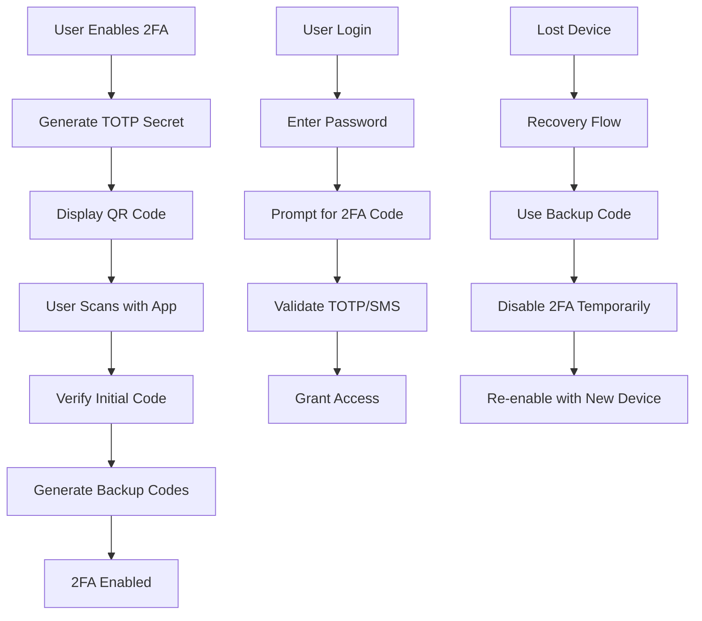

# Two-Factor Authentication Implementation

## Description

Implement comprehensive two-factor authentication (2FA) for the ShopFlow platform to enhance account security and meet SOC 2 Type II compliance requirements. This includes TOTP (Time-based One-Time Password), SMS verification, and backup codes with user-friendly setup and recovery flows.

## Acceptance Criteria

- [ ] TOTP authentication using Google Authenticator/Authy
- [ ] SMS-based 2FA with carrier support validation
- [ ] Email-based 2FA as fallback option
- [ ] Backup codes generation and validation (10 codes)
- [ ] 2FA setup wizard with QR code generation
- [ ] 2FA recovery flow for lost devices
- [ ] Admin override capability for account recovery
- [ ] 2FA enforcement policies (optional/required per account type)
- [ ] Audit logging for all 2FA events
- [ ] Rate limiting for 2FA attempts
- [ ] Security compliance validation (SOC 2 Type II)
- [ ] User education materials and help documentation

## Current Status: BLOCKED

### Blocking Issues

#### 1. Security Audit Approval (High Priority)
**Blocker**: Corporate Security Team Audit  
**Created**: 2025-01-05T14:00:00Z  
**Status**: Waiting for security team availability  
**Expected Resolution**: 2025-01-12T17:00:00Z  

**Details**:
- Required: Comprehensive security review of 2FA implementation design
- Scope: TOTP algorithm validation, SMS provider security, backup code storage
- Requirements: Penetration testing of 2FA flows
- Impact: Cannot proceed with implementation without security approval
- Contact: @chief-security-officer, @security-architect

**Mitigation Efforts**:
- ✅ Submitted detailed security design document (2025-01-05)
- ✅ Provided threat modeling analysis (2025-01-06)
- 🔄 Scheduled preliminary review meeting (2025-01-09T10:00:00Z)
- 📋 Preparing for formal security presentation (2025-01-11T14:00:00Z)

#### 2. SOC 2 Compliance Validation (High Priority)
**Blocker**: Legal/Compliance Team Review  
**Created**: 2025-01-06T10:00:00Z  
**Status**: Compliance requirements analysis in progress  
**Expected Resolution**: 2025-01-15T17:00:00Z  

**Details**:
- Required: SOC 2 Type II control framework compliance validation
- Scope: 2FA controls, audit logging, data protection requirements
- Requirements: Legal review of SMS provider agreements, data retention policies
- Impact: Implementation approach may need modification for compliance
- Contact: @compliance-officer, @legal-counsel

**Compliance Requirements Under Review**:
- User consent mechanisms for SMS 2FA
- Data retention policies for 2FA audit logs
- Third-party vendor assessment (SMS provider)
- International data transfer compliance (GDPR)
- Audit trail requirements and access controls

### Preparatory Work Completed

While blocked, the team has completed significant preparatory work:

#### Technical Architecture (Complete)
```yaml
2fa_architecture:
  totp_service:
    library: "otplib" # RFC 6238 compliant
    secret_length: 32_bytes
    time_window: 30_seconds
    tolerance: 1_window # ±30s clock drift
    
  sms_service:
    provider: "Twilio" # pending security approval
    fallback_provider: "AWS SNS"
    rate_limit: 3_attempts_per_15_minutes
    verification_timeout: 10_minutes
    
  backup_codes:
    algorithm: "crypto.randomBytes"
    length: 8_characters
    quantity: 10_codes
    hashing: "bcrypt" # cost factor 12
    single_use: true
    
  database_schema:
    user_2fa_settings: "designed"
    totp_secrets: "encrypted at rest"
    backup_codes: "hashed storage"
    audit_logs: "comprehensive tracking"
```

#### Security Design Document (Complete)
- **Threat Model**: Comprehensive analysis of 2FA attack vectors
- **Cryptographic Specifications**: TOTP algorithm implementation details  
- **Rate Limiting Strategy**: Protection against brute force attacks
- **Recovery Mechanisms**: Secure account recovery without 2FA device
- **Audit Requirements**: Complete activity logging and monitoring

#### Implementation Plan (Ready)


## AI Context Integration

<!-- AI_CONTEXT_START -->
Two-factor authentication implementation for ShopFlow platform. Currently blocked pending security audit and compliance review. Comprehensive 2FA system with TOTP, SMS, and backup codes.

**Planned Implementation:**
- `src/auth/2fa/totp.service.ts` - TOTP generation and validation
- `src/auth/2fa/sms.service.ts` - SMS-based verification
- `src/auth/2fa/backup-codes.service.ts` - Backup code management
- `src/auth/2fa/2fa.controller.ts` - API endpoints for 2FA operations
- `src/auth/2fa/2fa.middleware.ts` - 2FA validation middleware

**Security Requirements:**
- RFC 6238 compliant TOTP implementation
- Encrypted storage of TOTP secrets
- Rate limiting for all 2FA operations
- Comprehensive audit logging
- Secure backup code generation and storage

**Compliance Considerations:**
- SOC 2 Type II control requirements
- GDPR compliance for international users
- User consent for SMS communications
- Data retention and deletion policies
- Third-party vendor risk assessment

**Blocking Dependencies:**
- Corporate security team audit approval
- Legal/compliance review for SOC 2 requirements
- SMS provider security validation
- International compliance verification
<!-- AI_CONTEXT_END -->

## Token Usage Analysis

### Research & Planning Phase (Complete)
| Phase | Tokens Used | AI Agent | Purpose | Status |
|-------|-------------|----------|---------|--------|
| Security Research | 456 | Claude | 2FA security best practices, threat analysis | ✅ Complete |
| Architecture Design | 291 | Claude | TOTP/SMS service architecture | ✅ Complete |
| Compliance Analysis | 355 | GPT-4 | SOC 2 requirements, GDPR considerations | ✅ Complete |
| Implementation Planning | 145 | Claude | Development roadmap, task breakdown | ✅ Complete |

### AI Contributions During Planning

#### Claude Security Analysis (892 tokens)
- **TOTP Implementation**: RFC 6238 compliance analysis and library recommendations
- **Backup Code Strategy**: Secure generation, storage, and validation patterns
- **Rate Limiting Design**: Protection against brute force and timing attacks
- **Recovery Flow Security**: Secure account recovery without compromising security
- **Database Schema**: Encrypted storage design for sensitive 2FA data

#### GPT-4 Compliance Review (355 tokens)
- **SOC 2 Requirements**: Control framework analysis for 2FA implementation
- **GDPR Considerations**: International compliance for SMS and data storage
- **Industry Standards**: NIST guidelines and authentication best practices
- **Risk Assessment**: Threat modeling and mitigation strategies

### Planned Token Usage (Post-Unblock)
```
Implementation Phase:    8,000 tokens (code generation, testing)
Security Testing:        3,000 tokens (vulnerability analysis)
Compliance Validation:   2,000 tokens (audit preparation)
Documentation:           1,500 tokens (user guides, admin docs)
Total Estimated:        14,500 tokens
```

## Activity Log

### Recent Blocking Events
- **2025-01-07T09:30:00Z**: Status update by @security-team
  - Security audit still pending team availability
  - Preliminary review scheduled for 2025-01-09
  - Compliance review timeline confirmed

- **2025-01-06T10:00:00Z**: Blocked by compliance review
  - Legal/compliance team raised SOC 2 questions
  - Additional documentation requested
  - Timeline extended to 2025-01-15

- **2025-01-05T14:00:00Z**: Blocked by security audit requirement
  - Corporate security team mandated review
  - Cannot proceed with implementation
  - Security design document submitted

- **2025-01-04T16:30:00Z**: Architecture completed by @security-team
  - Technical design finalized
  - Claude assistance with security best practices (tokens: 291)
  - Ready for implementation pending approvals

- **2025-01-03T11:15:00Z**: Updated by @ai-agent-gpt4
  - Compliance requirements analysis
  - SOC 2 control mapping completed
  - Token usage: 355

- **2025-01-02T18:20:00Z**: Initial research by @ai-agent-claude
  - 2FA security patterns analyzed
  - TOTP vs SMS security comparison
  - Token usage: 456

- **2025-01-02T15:00:00Z**: Created by @sarah-chen
  - Issue created with 2FA requirements
  - Security team assignment
  - Epic assignment and initial planning

### Escalation Attempts
1. **Security Team Escalation** (2025-01-06T14:00:00Z)
   - Reached out to @chief-security-officer
   - Explained business impact and timeline
   - Secured commitment for 2025-01-09 preliminary review

2. **Compliance Escalation** (2025-01-07T08:00:00Z)
   - Discussed with @compliance-officer
   - Clarified SOC 2 requirements
   - Agreed on parallel review process

## Impact Analysis

### Business Impact of Delay
- **Security Risk**: Extended exposure without 2FA protection
- **Compliance Timeline**: SOC 2 certification may be delayed
- **Customer Trust**: Enterprise customers expecting 2FA availability
- **Competitive Position**: Competitors already offer 2FA features

### Technical Impact
- **Epic Dependencies**: EPIC-001 completion delayed
- **Integration Testing**: Cannot validate end-to-end auth flows
- **Sprint Planning**: Team capacity idle waiting for unblock
- **Technical Debt**: May need rushed implementation if delayed too long

### Resource Impact
- **Team Utilization**: @security-team partially idle (3.5 hours invested)
- **Sprint Goals**: Current sprint success metrics at risk
- **Token Budget**: 1,247 tokens used for planning (11% of issue allocation)
- **Timeline Risk**: Original target date of 2025-01-20 now unlikely

## Mitigation Strategies

### Parallel Work Streams
1. **Implementation Preparation**
   - Complete unit test structure
   - Finalize UI/UX designs for 2FA flows
   - Prepare integration test scenarios
   - Document deployment procedures

2. **Alternative Security Measures**
   - Implement enhanced password requirements
   - Add login anomaly detection
   - Strengthen account lockout policies
   - Improve audit logging coverage

3. **Communication Plan**
   - Weekly updates to stakeholders
   - Customer communication about timeline
   - Internal team coordination
   - Escalation to executive level if needed

### Risk Reduction
- **Phased Implementation**: Start with TOTP-only if SMS approval delayed
- **Feature Flags**: Deploy behind flags for gradual rollout
- **Rollback Plan**: Ensure quick rollback capability
- **Alternative Providers**: Pre-approve backup SMS providers

## Blocking Resolution Timeline

### Week of January 8-12, 2025
- **2025-01-09T10:00:00Z**: Preliminary security review meeting
- **2025-01-11T14:00:00Z**: Formal security team presentation
- **2025-01-12T17:00:00Z**: Expected security audit completion

### Week of January 13-17, 2025  
- **2025-01-13T09:00:00Z**: Compliance requirements finalization
- **2025-01-15T17:00:00Z**: Expected compliance review completion
- **2025-01-16T00:00:00Z**: Unblock date target (if both approvals received)

### Implementation Phase (Post-Unblock)
- **Week 1**: Core TOTP implementation and testing
- **Week 2**: SMS integration and backup codes
- **Week 3**: UI/UX implementation and integration testing
- **Week 4**: Security testing and production deployment

## Success Criteria for Unblocking

### Security Audit Approval Requirements
- [ ] Security design document approved
- [ ] Threat model validated by security team
- [ ] Cryptographic implementation approved
- [ ] Rate limiting strategy approved
- [ ] Audit logging requirements signed off

### Compliance Review Approval Requirements
- [ ] SOC 2 control mapping approved
- [ ] Data retention policy approved
- [ ] SMS provider agreement reviewed
- [ ] International compliance validated
- [ ] User consent mechanisms approved

### Technical Readiness (Current Status)
- [x] Architecture design complete
- [x] Database schema designed
- [x] API endpoints specified
- [x] Security threat model complete
- [x] Implementation plan ready
- [ ] Security audit passed
- [ ] Compliance review passed

## Communication Plan

### Stakeholder Updates
- **Daily**: @security-team internal standup
- **Weekly**: Project status to @sarah-chen (project lead)
- **Bi-weekly**: Executive summary to @cto
- **As-needed**: Customer communication via @customer-success

### Escalation Path
1. **Level 1**: @security-team → @security-architect
2. **Level 2**: @security-architect → @chief-security-officer  
3. **Level 3**: @chief-security-officer → @cto
4. **Level 4**: @cto → Executive team

### Communication Templates
- **Daily Standup**: "2FA blocked, security review pending, timeline TBD"
- **Weekly Status**: Detailed blocking status with timeline updates
- **Executive Summary**: Business impact and resolution timeline
- **Customer Communication**: Feature availability and security commitment

---

**Blocking Since**: 2025-01-05T14:00:00Z (3 days)  
**Expected Unblock**: 2025-01-16T00:00:00Z (9 days)  
**Business Impact**: High (security compliance)  
**Next Action**: Preliminary security review (2025-01-09T10:00:00Z)